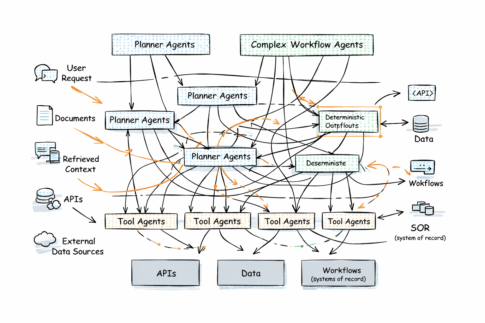

import { Callout } from 'nextra/components'

# Building Safe AI Systems

## Why This Handbook Exists

Enterprise AI is no longer just helping people work. It is starting to participate directly in how systems operate.
Across support, operations, legal, and finance, models are being embedded into workflows that read context, 
make decisions, and increasingly take actions across other systems.

This handbook is about how to build those systems safely. Not from a policy-first perspective, and 
not as a discussion about model capability. This is a handbook about system design — how to reason 
about control, where that control must live, 
and how to keep it explicit as capability increases.

<Callout type="important" emoji="⚙️">
This is not a handbook about what AI can do.  
It is about what an AI system is allowed to do.
</Callout>

---

## We Are Embedding Stochastic Systems Into Deterministic Software

Traditional enterprise software is built around explicit control. Behavior is defined ahead of time 
through code, workflows, and configuration. If something goes wrong, you trace the logic and fix it.
That model works because the system is deterministic. AI systems introduce something fundamentally different.

<Callout type="info" emoji="🧠">
They place a probabilistic decision layer inside the execution path.
</Callout>

This layer interprets context, decides what matters, selects tools, and proposes or initiates actions at runtime.
One way to think about these models — borrowing from the “stochastic parrots” framing — is that they generate behavior 
based on learned statistical patterns, not explicit logic encoded in code. That does not make them unreliable. It makes them **powerful and unpredictable in specific ways**.

The critical shift is this:

<Callout emoji="🔑">
We are taking systems that generate probabilistic outputs — and giving them the ability to drive deterministic actions.
</Callout>

### The decision layer is no longer fully in the code

In traditional systems, decisions are embedded directly in code and workflows. In AI systems, 
many of those decisions are inferred from context at runtime. That means system behavior can no longer be fully 
understood by reading the codebase.

Part of the system now lives in prompts, context, and runtime interpretation — not just in code.

---

## Safe AI is a Control Problem

Most teams start by focusing on capability.

Can the system answer better?  
Can it automate more of the workflow?  
Can it interact with more tools?

Those are useful questions.

But they are not the main ones.

<Callout type="warning" emoji="🛂">
Once a system can select tools, trigger workflows, and act across systems, the central question is 
no longer capability — it is authority, scope, and execution.
</Callout>

This is where traditional assumptions start to break.

Authorization is no longer a simple mapping from user to application to resource. 
Control flow is no longer fully encoded in code. System boundaries blur as context and tool access span across systems. 
Even the “model” is no longer a single artifact, but a combination of prompts, context, orchestration, and tools 
that together shape behavior.

These are not edge cases. They are the default operating conditions.

---

## The Principle

<Callout type="important" emoji="🧭">
Safe AI starts with a simple principle:  
**once a system can decide and act at runtime, control cannot live only in the codebase.**
</Callout>

If a system can interpret context, choose actions, and execute them across systems, then control must exist 
outside the code itself.

It must be explicit in:

- what context the system can use  
- what decisions it is allowed to make  
- what actions it is allowed to take  
- under whose authority those actions occur  
- how that behavior is made visible and traceable  

If you cannot answer these clearly, you do not have a controlled system.

---

## What Comes Next

Part I focuses on understanding the system you are building — the risks that emerge when context, 
decision-making, and action are combined, and what to look for when evaluating these systems.

From there, we build a practical model for designing safe AI systems in the enterprise.
Because the problem is not getting AI to work.
It is making sure it behaves within the boundaries you actually intend.

## Appendix — Further Reading

For readers who want to go deeper after this introduction, these are the five references I would start with. 
Together, they reinforce the core argument of this chapter: safe AI is not just a model problem or a governance 
problem — it is a systems control problem.

---

### 1. NIST Generative AI Profile
A strong bridge from traditional AI governance into modern generative AI. It extends the NIST AI Risk Management 
Framework with generative-AI-specific risks and suggested actions.

**Why it matters:**  
It helps frame the move from general governance language to practical concerns like hallucination, misuse, 
monitoring, provenance, and incident handling.

🔗 https://nvlpubs.nist.gov/nistpubs/ai/NIST.AI.600-1.pdf

---

### 2. Agentic AI Identity and Access Management
A strong reference for thinking about AI agents as security principals in their own right, with explicit 
credentials, permissions, and boundaries.

**Why it matters:**  
It supports the argument that traditional IAM and AAA models do not map cleanly onto agentic systems, 
especially once they become dynamic and semi-autonomous.

🔗 https://arxiv.org/pdf/2505.19301

---

### 3. Authenticated Delegation and Authorized AI Agents
A practical foundation for “act on behalf of” patterns in enterprise systems, with a focus on delegated authority, 
permission scoping, and auditability.

**Why it matters:**  
It sharpens the distinction between user intent, delegated authority, and agent execution — which becomes critical 
once systems start acting across multiple tools and services.

🔗 https://arxiv.org/abs/2501.09674

---

### 4. Securing the Model Context Protocol (MCP)
A useful paper for understanding that context exchange and tool integration are not just implementation 
details — they are part of the system’s attack surface and control surface.

**Why it matters:**  
It reinforces the idea that context is not just input. It is part of the boundary that must be controlled when 
models can access tools and external systems dynamically.

🔗 https://arxiv.org/abs/2511.20920

---

### 5. Trustworthy AI Posture (TAIP)
A strong reference on continuous assurance for agentic systems, moving beyond one-time reviews toward ongoing 
operational trust.

**Why it matters:**  
It supports the principle that once systems can decide and act at runtime, trust and control must also be 
established and measured at runtime.

🔗 https://arxiv.org/abs/2603.03340